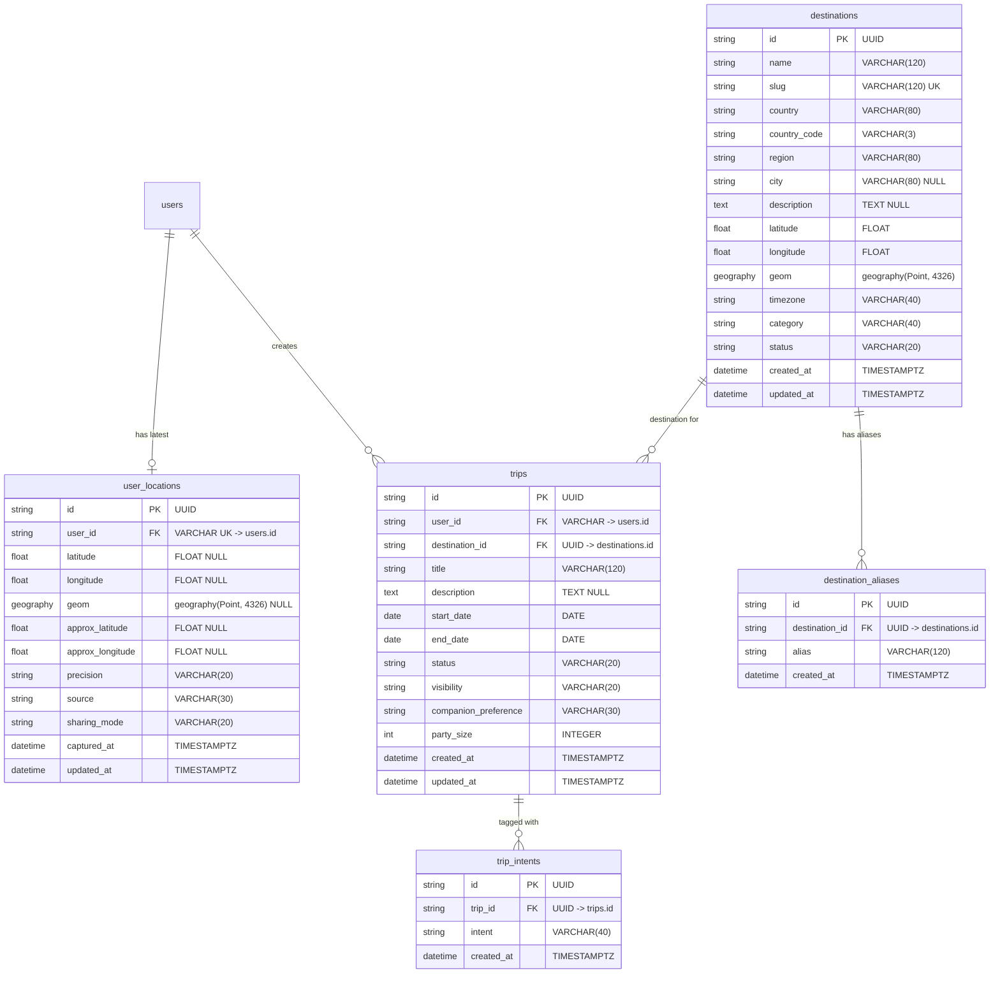

# TravelMate Travel & Location Database Schema

This document details the database schema, constraints, indexes, and PostGIS types introduced in Phase 6 (Alembic migration `20261001_000004_trips_and_destinations`).

Total SQLAlchemy models registered: **21 tables**.

---

## 1. Schema Diagram

---

## 2. Table Specifications

### 2.1 `destinations`
Stores authoritative locations curated for trips, discovery, and search.

| Column | Type | Nullable | Description / Constraint |
| :--- | :--- | :--- | :--- |
| `id` | `VARCHAR(36)` | No | Primary Key (UUIDv4) |
| `name` | `VARCHAR(120)` | No | Destination display name |
| `slug` | `VARCHAR(120)` | No | Unique index `uq_destinations_slug` |
| `country` | `VARCHAR(80)` | No | Full country name |
| `country_code` | `VARCHAR(3)` | No | ISO country code |
| `region` | `VARCHAR(80)` | No | State / Province / District |
| `city` | `VARCHAR(80)` | Yes | Municipality or nearest city |
| `description` | `TEXT` | Yes | Curated travel overview |
| `latitude` | `FLOAT` | No | WGS84 latitude (-90.0 to 90.0) |
| `longitude` | `FLOAT` | No | WGS84 longitude (-180.0 to 180.0) |
| `geom` | `geography(Point, 4326)` | Yes | PostGIS spherical point representation |
| `timezone` | `VARCHAR(40)` | No | Default `'UTC'` |
| `category` | `VARCHAR(40)` | No | `'city'`, `'beach'`, `'mountain'`, etc. |
| `status` | `VARCHAR(20)` | No | CHECK: `status IN ('active', 'draft', 'archived')` |
| `created_at` | `TIMESTAMPTZ` | No | Server timestamp |
| `updated_at` | `TIMESTAMPTZ` | No | Server timestamp |

**Indexes**:
- `idx_destinations_country_code` on `(country_code)`
- `idx_destinations_category` on `(category)`
- `idx_destinations_status` on `(status)`
- `idx_destinations_geom_gist` on `(geom)` USING `gist`

---

### 2.2 `destination_aliases`
Maps historical names, alternate romanizations, and colloquial abbreviations to authoritative destination records.

| Column | Type | Nullable | Description / Constraint |
| :--- | :--- | :--- | :--- |
| `id` | `VARCHAR(36)` | No | Primary Key (UUIDv4) |
| `destination_id` | `VARCHAR(36)` | No | Foreign Key `destinations.id` (ON DELETE CASCADE) |
| `alias` | `VARCHAR(120)` | No | Normalized lowercase alias string |
| `created_at` | `TIMESTAMPTZ` | No | Creation timestamp |

**Indexes**:
- Unique index `uq_destination_alias` on `(destination_id, alias)`
- Index `idx_destination_alias_search` on `(alias)`

---

### 2.3 `user_locations`
Stores privacy-managed, optional location state for authenticated users.

| Column | Type | Nullable | Description / Constraint |
| :--- | :--- | :--- | :--- |
| `id` | `VARCHAR(36)` | No | Primary Key (UUIDv4) |
| `user_id` | `VARCHAR(36)` | No | Unique Foreign Key `users.id` (ON DELETE CASCADE) |
| `latitude` | `FLOAT` | Yes | Raw latitude (only stored if permitted) |
| `longitude` | `FLOAT` | Yes | Raw longitude (only stored if permitted) |
| `geom` | `geography(Point, 4326)` | Yes | PostGIS point |
| `approx_latitude` | `FLOAT` | Yes | Grid-snapped latitude centroid (~5km) |
| `approx_longitude`| `FLOAT` | Yes | Grid-snapped longitude centroid (~5km) |
| `precision` | `VARCHAR(20)` | No | CHECK: `precision IN ('exact', 'approximate', 'city', 'region')` |
| `source` | `VARCHAR(30)` | No | CHECK: `source IN ('browser', 'ip', 'manual', 'trip')` |
| `sharing_mode` | `VARCHAR(20)` | No | CHECK: `sharing_mode IN ('private', 'approximate', 'explicit_share')` |
| `captured_at` | `TIMESTAMPTZ` | No | Timestamp of capture |
| `updated_at` | `TIMESTAMPTZ` | No | Timestamp of last modification |

---

### 2.4 `trips`
Core entity for trip planning, traveler itineraries, and discovery.

| Column | Type | Nullable | Description / Constraint |
| :--- | :--- | :--- | :--- |
| `id` | `VARCHAR(36)` | No | Primary Key (UUIDv4) |
| `user_id` | `VARCHAR(36)` | No | Foreign Key `users.id` (ON DELETE CASCADE) |
| `destination_id` | `VARCHAR(36)` | No | Foreign Key `destinations.id` (ON DELETE RESTRICT) |
| `title` | `VARCHAR(120)` | No | Trip heading |
| `description` | `TEXT` | Yes | Trip itinerary and traveler notes |
| `start_date` | `DATE` | No | Start date (inclusive) |
| `end_date` | `DATE` | No | End date (inclusive) |
| `status` | `VARCHAR(20)` | No | CHECK: `status IN ('draft', 'planned', 'active', 'completed', 'cancelled', 'archived')` |
| `visibility` | `VARCHAR(20)` | No | CHECK: `visibility IN ('private', 'matches_only', 'discoverable', 'public')` |
| `companion_preference` | `VARCHAR(30)` | No | CHECK: `companion_preference IN ('travelling_alone', 'open_to_companion', 'travelling_with_group')` |
| `party_size` | `INTEGER` | No | Default `1`, CHECK: `party_size >= 1 AND party_size <= 50` |
| `created_at` | `TIMESTAMPTZ` | No | Creation timestamp |
| `updated_at` | `TIMESTAMPTZ` | No | Last update timestamp |

**Check Constraints**:
- `ck_trip_dates`: `start_date <= end_date`

**Indexes**:
- `idx_trips_user_id` on `(user_id)`
- `idx_trips_destination_id` on `(destination_id)`
- `idx_trips_status` on `(status)`
- `idx_trips_visibility` on `(visibility)`
- `idx_trips_dates` on `(start_date, end_date)`

---

### 2.5 `trip_intents`
Associates normalized travel intent tags with trips for discovery filtering.

| Column | Type | Nullable | Description / Constraint |
| :--- | :--- | :--- | :--- |
| `id` | `VARCHAR(36)` | No | Primary Key (UUIDv4) |
| `trip_id` | `VARCHAR(36)` | No | Foreign Key `trips.id` (ON DELETE CASCADE) |
| `intent` | `VARCHAR(40)` | No | Tag name (e.g. `'sightseeing'`, `'foodie'`) |
| `created_at` | `TIMESTAMPTZ` | No | Creation timestamp |

**Indexes**:
- Unique index `uq_trip_intent` on `(trip_id, intent)`
- Index `idx_trip_intents_intent` on `(intent)`
